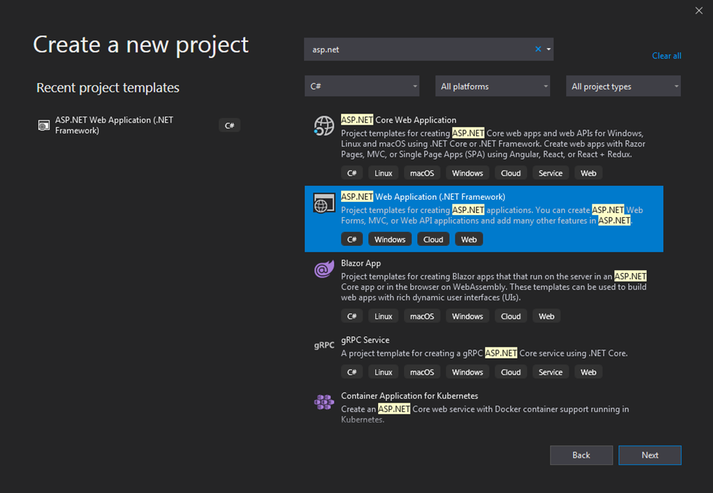
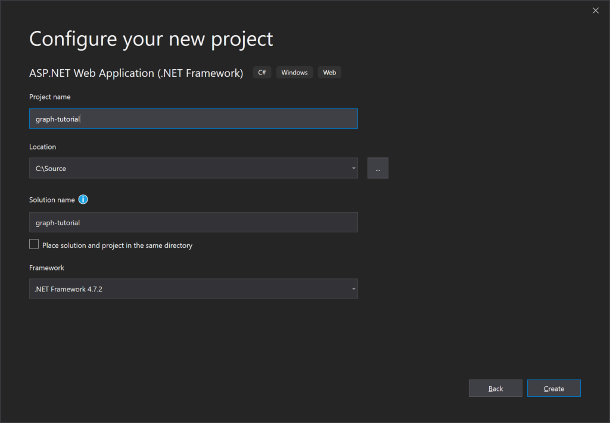
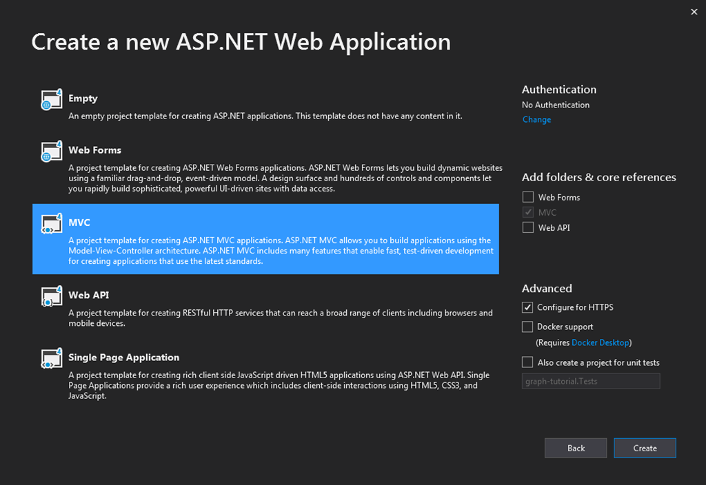
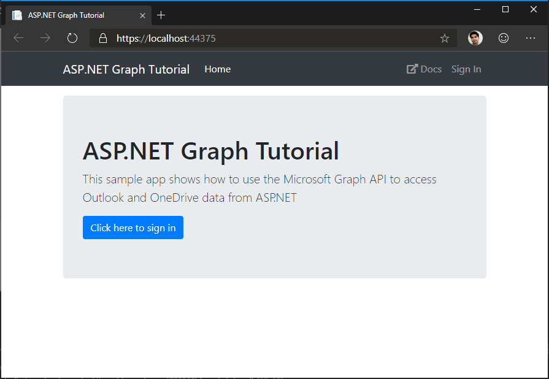

<!-- markdownlint-disable MD002 MD041 -->

<span data-ttu-id="5d6d9-101">Erstellen Sie zunächst ein ASP.NET MVC-Projekt.</span><span class="sxs-lookup"><span data-stu-id="5d6d9-101">Start by creating an ASP.NET MVC project.</span></span>

1. <span data-ttu-id="5d6d9-102">Öffnen Sie Visual Studio, und wählen Sie **Neues Projekt erstellen**aus.</span><span class="sxs-lookup"><span data-stu-id="5d6d9-102">Open Visual Studio, and select **Create a new project**.</span></span>

1. <span data-ttu-id="5d6d9-103">Wählen Sie im Dialogfeld **Neues Projekt erstellen** die Option **ASP.NET-Webanwendung (.NET Framework)** aus, die C# verwendet, und wählen Sie dann **weiter**aus.</span><span class="sxs-lookup"><span data-stu-id="5d6d9-103">In the **Create new project** dialog, choose the **ASP.NET Web Application (.NET Framework)** option that uses C#, then select **Next**.</span></span>

    

1. <span data-ttu-id="5d6d9-105">Geben `graph-tutorial` Sie in das Feld **Projektname** ein, und wählen Sie **Erstellen**aus.</span><span class="sxs-lookup"><span data-stu-id="5d6d9-105">Enter `graph-tutorial` in the **Project name** field and select **Create**.</span></span>

    

    > [!NOTE]
    > <span data-ttu-id="5d6d9-107">Stellen Sie sicher, dass Sie genau den gleichen Namen für das Visual Studio Projekt eingeben, das in diesen Übungseinheiten angegeben ist.</span><span class="sxs-lookup"><span data-stu-id="5d6d9-107">Ensure that you enter the exact same name for the Visual Studio Project that is specified in these lab instructions.</span></span> <span data-ttu-id="5d6d9-108">Der Visual Studio Projektname wird Teil des Namespaces im Code.</span><span class="sxs-lookup"><span data-stu-id="5d6d9-108">The Visual Studio Project name becomes part of the namespace in the code.</span></span> <span data-ttu-id="5d6d9-109">Der Code in diesen Anweisungen hängt vom Namespace ab, der dem in diesen Anweisungen angegebenen Visual Studio Projektnamen entspricht.</span><span class="sxs-lookup"><span data-stu-id="5d6d9-109">The code inside these instructions depends on the namespace matching the Visual Studio Project name specified in these instructions.</span></span> <span data-ttu-id="5d6d9-110">Wenn Sie einen anderen Projektnamen verwenden, wird der Code nur dann kompiliert, wenn Sie alle Namespaces so anpassen, dass Sie dem Visual Studio Projektnamen entsprechen, den Sie beim Erstellen des Projekts eingeben.</span><span class="sxs-lookup"><span data-stu-id="5d6d9-110">If you use a different project name the code will not compile unless you adjust all the namespaces to match the Visual Studio Project name you enter when you create the project.</span></span>

1. <span data-ttu-id="5d6d9-111">Wählen Sie **MVC** aus, und wählen Sie **Erstellen**aus.</span><span class="sxs-lookup"><span data-stu-id="5d6d9-111">Choose **MVC** and select **Create**.</span></span>

    

1. <span data-ttu-id="5d6d9-113">Drücken Sie **F5** , oder wählen Sie **Debug #a0 Debuggen starten**aus.</span><span class="sxs-lookup"><span data-stu-id="5d6d9-113">Press **F5** or select **Debug > Start Debugging**.</span></span> <span data-ttu-id="5d6d9-114">Wenn alles funktioniert, sollte der Standardbrowser geöffnet und eine standardmäßige ASP.NET-Seite angezeigt werden.</span><span class="sxs-lookup"><span data-stu-id="5d6d9-114">If everything is working, your default browser should open and display a default ASP.NET page.</span></span>

## <a name="add-nuget-packages"></a><span data-ttu-id="5d6d9-115">NuGet-Pakete hinzufügen</span><span class="sxs-lookup"><span data-stu-id="5d6d9-115">Add NuGet packages</span></span>

<span data-ttu-id="5d6d9-116">Bevor Sie fortfahren, aktualisieren `bootstrap` Sie das NuGet-Paket, und installieren Sie einige zusätzliche NuGet-Pakete, die Sie später verwenden werden.</span><span class="sxs-lookup"><span data-stu-id="5d6d9-116">Before moving on, update the `bootstrap` NuGet package, and install some additional NuGet packages that you will use later.</span></span>

- <span data-ttu-id="5d6d9-117">[Microsoft. Owin. Host. SystemWeb](https://www.nuget.org/packages/Microsoft.Owin.Host.SystemWeb/) zum Aktivieren der [Owin](http://owin.org/) -Schnittstellen in der ASP.NET-Anwendung.</span><span class="sxs-lookup"><span data-stu-id="5d6d9-117">[Microsoft.Owin.Host.SystemWeb](https://www.nuget.org/packages/Microsoft.Owin.Host.SystemWeb/) to enable the [OWIN](http://owin.org/) interfaces in the ASP.NET application.</span></span>
- <span data-ttu-id="5d6d9-118">[Microsoft. Owin. Security. OpenIdConnect](https://www.nuget.org/packages/Microsoft.Owin.Security.OpenIdConnect/) für die Durchführung der OpenID Connect-Authentifizierung mit Azure.</span><span class="sxs-lookup"><span data-stu-id="5d6d9-118">[Microsoft.Owin.Security.OpenIdConnect](https://www.nuget.org/packages/Microsoft.Owin.Security.OpenIdConnect/) for doing OpenID Connect authentication with Azure.</span></span>
- <span data-ttu-id="5d6d9-119">[Microsoft. Owin. Security. Cookies](https://www.nuget.org/packages/Microsoft.Owin.Security.Cookies/) , um die Cookie-basierte Authentifizierung zu aktivieren.</span><span class="sxs-lookup"><span data-stu-id="5d6d9-119">[Microsoft.Owin.Security.Cookies](https://www.nuget.org/packages/Microsoft.Owin.Security.Cookies/) to enable cookie-based authentication.</span></span>
- <span data-ttu-id="5d6d9-120">[Microsoft. Identity. Client](https://www.nuget.org/packages/Microsoft.Identity.Client/) zum Anfordern und Verwalten von Zugriffstoken.</span><span class="sxs-lookup"><span data-stu-id="5d6d9-120">[Microsoft.Identity.Client](https://www.nuget.org/packages/Microsoft.Identity.Client/) for requesting and managing access tokens.</span></span>
- <span data-ttu-id="5d6d9-121">[Microsoft. Graph](https://www.nuget.org/packages/Microsoft.Graph/) für das tätigen von Anrufen an Microsoft Graph.</span><span class="sxs-lookup"><span data-stu-id="5d6d9-121">[Microsoft.Graph](https://www.nuget.org/packages/Microsoft.Graph/) for making calls to Microsoft Graph.</span></span>

1. <span data-ttu-id="5d6d9-122">Wählen Sie **Tools #a0 NuGet-Paket-Manager #a1-Paket-Manager-Konsole**aus.</span><span class="sxs-lookup"><span data-stu-id="5d6d9-122">Select **Tools > NuGet Package Manager > Package Manager Console**.</span></span>
1. <span data-ttu-id="5d6d9-123">Geben Sie in der Paket-Manager-Konsole die folgenden Befehle ein.</span><span class="sxs-lookup"><span data-stu-id="5d6d9-123">In the Package Manager Console, enter the following commands.</span></span>

    ```Powershell
    Update-Package bootstrap
    Install-Package Microsoft.Owin.Host.SystemWeb
    Install-Package Microsoft.Owin.Security.OpenIdConnect
    Install-Package Microsoft.Owin.Security.Cookies
    Install-Package Microsoft.Identity.Client -Version 4.7.1
    Install-Package Microsoft.Graph -Version 1.20.0
    ```

## <a name="design-the-app"></a><span data-ttu-id="5d6d9-124">Entwerfen der APP</span><span class="sxs-lookup"><span data-stu-id="5d6d9-124">Design the app</span></span>

<span data-ttu-id="5d6d9-125">In diesem Abschnitt wird die grundlegende Struktur der Anwendung erstellt.</span><span class="sxs-lookup"><span data-stu-id="5d6d9-125">In this section you will create the basic structure of the application.</span></span>

1. <span data-ttu-id="5d6d9-126">Erstellen Sie eine grundlegende OWIN-Startklasse.</span><span class="sxs-lookup"><span data-stu-id="5d6d9-126">Create a basic OWIN startup class.</span></span> <span data-ttu-id="5d6d9-127">Klicken Sie im Projekt `graph-tutorial` Mappen-Explorer mit der rechten Maustaste auf den Ordner, und wählen Sie **#a0 neues Element hinzufügen**.</span><span class="sxs-lookup"><span data-stu-id="5d6d9-127">Right-click the `graph-tutorial` folder in Solution Explorer and select **Add > New Item**.</span></span> <span data-ttu-id="5d6d9-128">Wählen Sie die **OWIN-Startklassen** Vorlage aus, `Startup.cs`benennen Sie die Datei, und wählen Sie **Hinzufügen**aus.</span><span class="sxs-lookup"><span data-stu-id="5d6d9-128">Choose the **OWIN Startup Class** template, name the file `Startup.cs`, and select **Add**.</span></span>

1. <span data-ttu-id="5d6d9-129">Klicken Sie im Projektmappen-Explorer mit der rechten Maustaste auf den Ordner **Modelle** , und wählen Sie **#a0 Klasse hinzufügen**aus. Nennen Sie die `Alert` Klasse, und wählen Sie **Hinzufügen**aus.</span><span class="sxs-lookup"><span data-stu-id="5d6d9-129">Right-click the **Models** folder in Solution Explorer and select **Add > Class...**. Name the class `Alert` and select **Add**.</span></span> <span data-ttu-id="5d6d9-130">Ersetzen Sie den gesamten Inhalt `Alert.cs` durch den folgenden Code.</span><span class="sxs-lookup"><span data-stu-id="5d6d9-130">Replace the entire contents of `Alert.cs` with the following code.</span></span>

    ```cs
    namespace graph_tutorial.Models
    {
        // Used to flash error messages in the app's views.
        public class Alert
        {
            public const string AlertKey = "TempDataAlerts";
            public string Message { get; set; }
            public string Debug { get; set; }
        }
    }
    ```

1. <span data-ttu-id="5d6d9-131">Öffnen Sie `./Views/Shared/_Layout.cshtml` die Datei, und ersetzen Sie den gesamten Inhalt durch den folgenden Code, um das globale Layout der APP zu aktualisieren.</span><span class="sxs-lookup"><span data-stu-id="5d6d9-131">Open the `./Views/Shared/_Layout.cshtml` file, and replace its entire contents with the following code to update the global layout of the app.</span></span>

    ```html
    @{
        var alerts = TempData.ContainsKey(graph_tutorial.Models.Alert.AlertKey) ?
            (List<graph_tutorial.Models.Alert>)TempData[graph_tutorial.Models.Alert.AlertKey] :
            new List<graph_tutorial.Models.Alert>();
    }

    <!DOCTYPE html>
    <html>
    <head>
        <meta charset="utf-8" />
        <meta name="viewport" content="width=device-width, initial-scale=1.0">
        <title>ASP.NET Graph Tutorial</title>
        @Styles.Render("~/Content/css")
        @Scripts.Render("~/bundles/modernizr")

        <link rel="stylesheet" href="https://use.fontawesome.com/releases/v5.1.0/css/all.css"
              integrity="sha384-lKuwvrZot6UHsBSfcMvOkWwlCMgc0TaWr+30HWe3a4ltaBwTZhyTEggF5tJv8tbt"
              crossorigin="anonymous">
    </head>

    <body>
        <nav class="navbar navbar-expand-md navbar-dark fixed-top bg-dark">
            <div class="container">
                @Html.ActionLink("ASP.NET Graph Tutorial", "Index", "Home", new { area = "" }, new { @class = "navbar-brand" })
                <button class="navbar-toggler" type="button" data-toggle="collapse" data-target="#navbarCollapse"
                        aria-controls="navbarCollapse" aria-expanded="false" aria-label="Toggle navigation">
                    <span class="navbar-toggler-icon"></span>
                </button>
                <div class="collapse navbar-collapse" id="navbarCollapse">
                    <ul class="navbar-nav mr-auto">
                        <li class="nav-item">
                            @Html.ActionLink("Home", "Index", "Home", new { area = "" },
                                new { @class = ViewBag.Current == "Home" ? "nav-link active" : "nav-link" })
                        </li>
                        @if (Request.IsAuthenticated)
                        {
                            <li class="nav-item" data-turbolinks="false">
                                @Html.ActionLink("Calendar", "Index", "Calendar", new { area = "" },
                                    new { @class = ViewBag.Current == "Calendar" ? "nav-link active" : "nav-link" })
                            </li>
                        }
                    </ul>
                    <ul class="navbar-nav justify-content-end">
                        <li class="nav-item">
                            <a class="nav-link" href="https://developer.microsoft.com/graph/docs/concepts/overview" target="_blank">
                                <i class="fas fa-external-link-alt mr-1"></i>Docs
                            </a>
                        </li>
                        @if (Request.IsAuthenticated)
                        {
                            <li class="nav-item dropdown">
                                <a class="nav-link dropdown-toggle" data-toggle="dropdown" href="#" role="button" aria-haspopup="true" aria-expanded="false">
                                    @if (!string.IsNullOrEmpty(ViewBag.User.Avatar))
                                    {
                                        
                                    }
                                    else
                                    {
                                        <i class="far fa-user-circle fa-lg rounded-circle align-self-center mr-2" style="width: 32px;"></i>
                                    }
                                </a>
                                <div class="dropdown-menu dropdown-menu-right">
                                    <h5 class="dropdown-item-text mb-0">@ViewBag.User.DisplayName</h5>
                                    <p class="dropdown-item-text text-muted mb-0">@ViewBag.User.Email</p>
                                    <div class="dropdown-divider"></div>
                                    @Html.ActionLink("Sign Out", "SignOut", "Account", new { area = "" }, new { @class = "dropdown-item" })
                                </div>
                            </li>
                        }
                        else
                        {
                            <li class="nav-item">
                                @Html.ActionLink("Sign In", "SignIn", "Account", new { area = "" }, new { @class = "nav-link" })
                            </li>
                        }
                    </ul>
                </div>
            </div>
        </nav>
        <main role="main" class="container">
            @foreach (var alert in alerts)
            {
                <div class="alert alert-danger" role="alert">
                    <p class="mb-3">@alert.Message</p>
                    @if (!string.IsNullOrEmpty(alert.Debug))
                    {
                        <pre class="alert-pre border bg-light p-2"><code>@alert.Debug</code></pre>
                    }
                </div>
            }

            @RenderBody()
        </main>
        @Scripts.Render("~/bundles/jquery")
        @Scripts.Render("~/bundles/bootstrap")
        @RenderSection("scripts", required: false)
    </body>
    </html>
    ```

    > [!NOTE]
    > <span data-ttu-id="5d6d9-132">Dieser Code fügt [Bootstrap](https://getbootstrap.com/) für einfaches Styling und [Font awesome](https://fontawesome.com/) für einige einfache Symbole hinzu.</span><span class="sxs-lookup"><span data-stu-id="5d6d9-132">This code adds [Bootstrap](https://getbootstrap.com/) for simple styling, and [Font Awesome](https://fontawesome.com/) for some simple icons.</span></span> <span data-ttu-id="5d6d9-133">Außerdem wird ein globales Layout mit einer Navigationsleiste definiert und die `Alert` Klasse verwendet, um Warnungen anzuzeigen.</span><span class="sxs-lookup"><span data-stu-id="5d6d9-133">It also defines a global layout with a nav bar, and uses the `Alert` class to display any alerts.</span></span>

1. <span data-ttu-id="5d6d9-134">Öffnen `Content/Site.css` Sie den gesamten Inhalt, und ersetzen Sie ihn durch den folgenden Code.</span><span class="sxs-lookup"><span data-stu-id="5d6d9-134">Open `Content/Site.css` and replace its entire contents with the following code.</span></span>

    ```css
    body {
      padding-top: 4.5rem;
    }

    .alert-pre {
      word-wrap: break-word;
      word-break: break-all;
      white-space: pre-wrap;
    }
    ```

1. <span data-ttu-id="5d6d9-135">Öffnen Sie `Views/Home/index.cshtml` die Datei, und ersetzen Sie den Inhalt durch Folgendes.</span><span class="sxs-lookup"><span data-stu-id="5d6d9-135">Open the `Views/Home/index.cshtml` file and replace its contents with the following.</span></span>

    ```html
    @{
        ViewBag.Current = "Home";
    }

    <div class="jumbotron">
        <h1>ASP.NET Graph Tutorial</h1>
        <p class="lead">This sample app shows how to use the Microsoft Graph API to access Outlook and OneDrive data from ASP.NET</p>
        @if (Request.IsAuthenticated)
        {
            <h4>Welcome @ViewBag.User.DisplayName!</h4>
            <p>Use the navigation bar at the top of the page to get started.</p>
        }
        else
        {
            @Html.ActionLink("Click here to sign in", "SignIn", "Account", new { area = "" }, new { @class = "btn btn-primary btn-large" })
        }
    </div>
    ```

1. <span data-ttu-id="5d6d9-136">Klicken Sie im Projektmappen-Explorer mit der rechten Maustaste auf den Ordner **Controller** , und wählen Sie **#a0 Controller hinzufügen**aus.... Wählen Sie **MVC 5 Controller – leer** , und wählen Sie **Hinzufügen**aus.</span><span class="sxs-lookup"><span data-stu-id="5d6d9-136">Right-click the **Controllers** folder in Solution Explorer and select **Add > Controller...**. Choose **MVC 5 Controller - Empty** and select **Add**.</span></span> <span data-ttu-id="5d6d9-137">Nennen Sie den `BaseController` Controller, und wählen Sie **Hinzufügen**aus.</span><span class="sxs-lookup"><span data-stu-id="5d6d9-137">Name the controller `BaseController` and select **Add**.</span></span> <span data-ttu-id="5d6d9-138">Ersetzen Sie den Inhalt von `BaseController.cs` durch den folgenden Code.</span><span class="sxs-lookup"><span data-stu-id="5d6d9-138">Replace the contents of `BaseController.cs` with the following code.</span></span>

    ```cs
    using graph_tutorial.Models;
    using System.Collections.Generic;
    using System.Web.Mvc;

    namespace graph_tutorial.Controllers
    {
        public abstract class BaseController : Controller
        {
            protected void Flash(string message, string debug=null)
            {
                var alerts = TempData.ContainsKey(Alert.AlertKey) ?
                    (List<Alert>)TempData[Alert.AlertKey] :
                    new List<Alert>();

                alerts.Add(new Alert
                {
                    Message = message,
                    Debug = debug
                });

                TempData[Alert.AlertKey] = alerts;
            }
        }
    }
    ```

1. <span data-ttu-id="5d6d9-139">Öffnen `Controllers/HomeController.cs` Sie und ändern `public class HomeController : Controller` Sie die-Reihe in:</span><span class="sxs-lookup"><span data-stu-id="5d6d9-139">Open `Controllers/HomeController.cs` and change the `public class HomeController : Controller` line to:</span></span>

    ```cs
    public class HomeController : BaseController
    ```

1. <span data-ttu-id="5d6d9-140">Speichern Sie alle Änderungen, und starten Sie den Server neu.</span><span class="sxs-lookup"><span data-stu-id="5d6d9-140">Save all of your changes and restart the server.</span></span> <span data-ttu-id="5d6d9-141">Nun sollte die APP sehr unterschiedlich aussehen.</span><span class="sxs-lookup"><span data-stu-id="5d6d9-141">Now, the app should look very different.</span></span>

    
