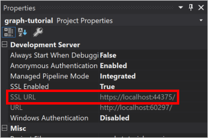
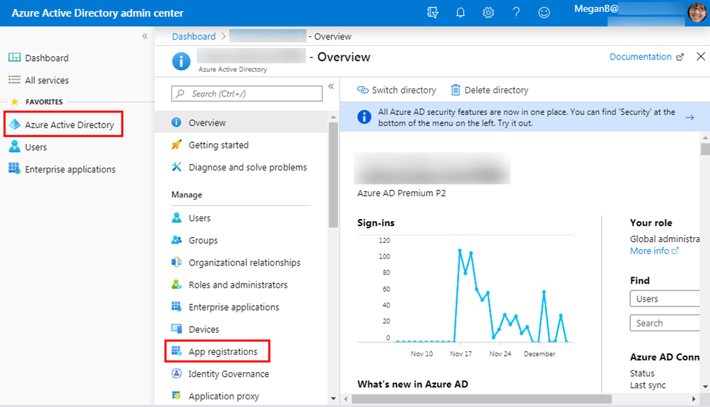
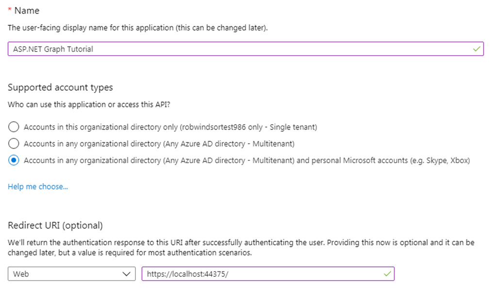

<!-- markdownlint-disable MD002 MD041 -->

In dieser Übung erstellen Sie mithilfe des Azure Active Directory Admin Center eine neue Azure AD-Webanwendungs Registrierung.In this exercise, you will create a new Azure AD web application registration using the Azure Active Directory admin center.

1. Bestimmen Sie die SSL-URL der ASP.net-app.Determine your ASP.NET app's SSL URL. Wählen Sie im Projektmappen-Explorer von Visual Studio das **Graph-Tutorial-** Projekt aus.In Visual Studio's Solution Explorer, select the **graph-tutorial** project. Suchen Sie im Fenster **Eigenschaften** den Wert der **SSL-URL**.In the **Properties** window, find the value of **SSL URL**. Kopieren Sie diesen Wert.Copy this value.

    

1. Öffnen Sie einen Browser, und navigieren Sie zum [Azure Active Directory Admin Center](https://aad.portal.azure.com).Open a browser and navigate to the [Azure Active Directory admin center](https://aad.portal.azure.com). Melden Sie sich mit einem **persönlichen Konto** (auch: Microsoft-Konto) oder einem **Geschäfts- oder Schulkonto** an.Login using a **personal account** (aka: Microsoft Account) or **Work or School Account**.

1. Wählen Sie in der linken Navigationsleiste **Azure Active Directory** aus, und wählen Sie dann **App** -Registrierungen unter **Manage**aus.Select **Azure Active Directory** in the left-hand navigation, then select **App registrations** under **Manage**.

    

1. Wählen Sie **Neue Registrierung** aus.Select **New registration**. Legen Sie auf der Seite **Anwendung registrieren** die Werte wie folgt fest.On the **Register an application** page, set the values as follows.

    - Legen Sie **Name** auf `ASP.NET Graph Tutorial` fest.Set **Name** to `ASP.NET Graph Tutorial`.
    - Legen Sie **Unterstützte Kontotypen** auf **Konten in allen Organisationsverzeichnissen und persönliche Microsoft-Konten** fest.Set **Supported account types** to **Accounts in any organizational directory and personal Microsoft accounts**.
    - Legen Sie unter **Umleitungs-URI** die erste Dropdownoption auf `Web` fest, und legen Sie den Wert der URL der ASP.NET-App fest, die Sie in Schritt 1 kopiert haben.Under **Redirect URI**, set the first drop-down to `Web` and set the value to the ASP.NET app URL you copied in step 1.

    

1. Wählen Sie **registrieren**aus.Select **Register**. Kopieren Sie auf der Seite **ASP.NET Graph Tutorial** den Wert der **Anwendungs-ID (Client)** , und speichern Sie ihn, die Sie im nächsten Schritt benötigen.On the **ASP.NET Graph Tutorial** page, copy the value of the **Application (client) ID** and save it, you will need it in the next step.

    

1. Wählen Sie unter **Verwalten** die Option **Authentifizierung** aus.Select **Authentication** under **Manage**. Suchen Sie den Abschnitt **Implizite Gewährung**, und aktivieren Sie **ID-Token**.Locate the **Implicit grant** section and enable **ID tokens**. Klicken Sie auf **Speichern**.Select **Save**.

    

1. Wählen Sie unter **Verwalten** die Option **Zertifikate und Geheime Clientschlüssel** aus.Select **Certificates & secrets** under **Manage**. Wählen Sie die Schaltfläche **Neuen geheimen Clientschlüssel** aus.Select the **New client secret** button. Geben Sie einen Wert in **Description** ein, und wählen Sie eine der Optionen für **Ablaufdatum** aus, und wählen Sie **Hinzufügen**aus.Enter a value in **Description** and select one of the options for **Expires** and select **Add**.

    

1. Kopieren Sie den Wert des geheimen Clientschlüssels, bevor Sie diese Seite verlassen.Copy the client secret value before you leave this page. Sie benötigen ihn im nächsten Schritt.You will need it in the next step.

    > [!IMPORTANT]
    > Dieser geheime Clientschlüssel wird nicht noch einmal angezeigt, stellen Sie daher sicher, dass Sie ihn jetzt kopieren.This client secret is never shown again, so make sure you copy it now.

    
