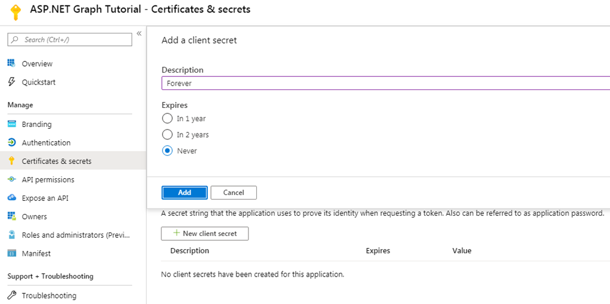

<!-- markdownlint-disable MD002 MD041 -->

In dieser Übung erstellen Sie eine neue Azure AD-Webanwendungs Registrierung mithilfe des Azure Active Directory Admin Center.In this exercise, you will create a new Azure AD web application registration using the Azure Active Directory admin center.

1. Bestimmen Sie die URL Ihrer ASP.NET-app.Determine your ASP.NET app's URL. Wählen Sie im projektMappen-Explorer von Visual Studio das Projekt **Graph-Tutorial** aus.In Visual Studio's Solution Explorer, select the **graph-tutorial** project. Suchen Sie im Fenster **Eigenschaften** den Wert der **URL**.In the **Properties** window, find the value of **URL**. Kopieren Sie diesen Wert.Copy this value.

    

1. Öffnen Sie einen Browser, und navigieren Sie zum [Azure Active Directory Admin Center](https://aad.portal.azure.com).Open a browser and navigate to the [Azure Active Directory admin center](https://aad.portal.azure.com). Melden Sie sich über ein **persönliches Konto** (aka: Microsoft-Konto) oder ein Geschäfts- **oder Schulkonto**an.Login using a **personal account** (aka: Microsoft Account) or **Work or School Account**.

1. Wählen Sie **Azure Active Directory** in der linken Navigationsleiste aus, und wählen Sie dann **App-Registrierungen (Vorschau)** unter **Manage**aus.Select **Azure Active Directory** in the left-hand navigation, then select **App registrations (Preview)** under **Manage**.

    

1. Wählen Sie **neue Registrierung**aus.Select **New registration**. Legen Sie auf der Seite **Anwendung registrieren** die Werte wie folgt fest.On the **Register an application** page, set the values as follows.

    - Legen \*\*\*\* Sie Name `ASP.NET Graph Tutorial`auf fest.Set **Name** to `ASP.NET Graph Tutorial`.
    - Legen Sie **unterstützte Kontotypen** auf **Konten in einem beliebigen Organisations Verzeichnis und persönlichen Microsoft-Konten**fest.Set **Supported account types** to **Accounts in any organizational directory and personal Microsoft accounts**.
    - Legen Sie unter umLeitungs- **URI**die erste Dropdown `Web` Liste auf fest, und legen Sie den Wert auf die ASP.net-App-URL fest, die Sie in Schritt 1 kopiert haben.Under **Redirect URI**, set the first drop-down to `Web` and set the value to the ASP.NET app URL you copied in step 1.

    

1. Wählen Sie **registrieren**aus.Choose **Register**. Kopieren Sie auf der Seite **ASP.NET Graph Tutorial** den Wert der **Anwendungs-ID (Client)** , und speichern Sie ihn, dann benötigen Sie ihn im nächsten Schritt.On the **ASP.NET Graph Tutorial** page, copy the value of the **Application (client) ID** and save it, you will need it in the next step.

    

1. Wählen Sie unter **Manage**die Option **Authentication** aus.Select **Authentication** under **Manage**. Suchen Sie den **impliziten Grant** -Abschnitt, und aktivieren Sie **ID-Token**.Locate the **Implicit grant** section and enable **ID tokens**. Wählen Sie **Speichern** aus.Choose **Save**.

    

1. Wählen Sie unter **Manage**die Option **Certificates & Secrets** aus.Select **Certificates & secrets** under **Manage**. Klicken Sie auf die Schaltfläche **neuen geheimen Client Schlüssel** .Select the **New client secret** button. Geben Sie einen Wert in **Description** ein, und wählen Sie eine der Optionen für **Expires** und wählen Sie **Hinzufügen**aus.Enter a value in **Description** and select one of the options for **Expires** and choose **Add**.

    

1. Kopieren Sie den Client geheimen Wert, bevor Sie diese Seite verlassen.Copy the client secret value before you leave this page. Sie benötigen Sie im nächsten Schritt.You will need it in the next step.

    > [!IMPORTANT]
    > Dieser geheime Client Schlüssel wird nie wieder angezeigt, stellen Sie daher sicher, dass Sie ihn jetzt kopieren.This client secret is never shown again, so make sure you copy it now.

    